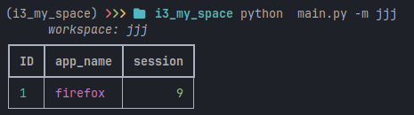
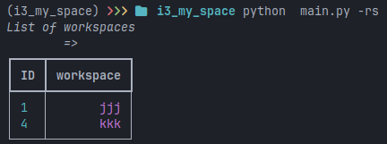
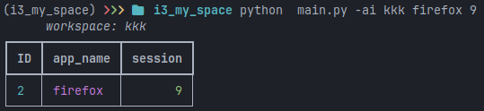
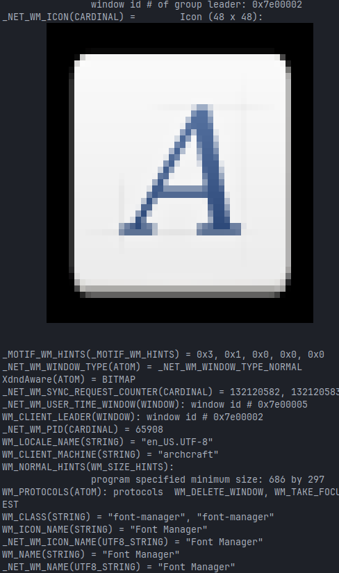

# **SPACES**

#### #intro

------

i don't know about you guys , but i always had a big problem with my computers !

> **OPENING APPS !!!!??????**

**what does it even mean ?**

imagine u r a programmer u need to open 

1. some specific apps when u wanna do java programming
2. some other apps when u work on c++
3. some other apps when u just wanna chill with you-tube
4. or even some apps when u wanna do just some office works

and u just need to do it every single time u open your PC 

isn't it just stupid ?

even if u set your Linux vm to open apps on startup it just open it and don't care if u sometimes maybe don't want that apps

> **so it is just some stupid work to do** 
>
> there is no way out 👿

no wait there is a way !

thats when my awesome tools the spaces come to place 

**it help you create** 

- workspaces   => u can crate multiple workspaces which on it u specify some apps and session and later on u can run that workspace it will open everything for u 
- desktop_session => spaces cli tools have ability to not just open apps but open them in desktop_session of your choice
- apps => finally it is made to open some apps right - u need to give it its xprop name (it is the name that apps have in your os , dont worry i will explain it )

simply i think this tools is not only useful for me but for every Linux users

#### #help

------

`usage: main.py [-h] [-m MAKE] [-rs] [-ai ADD_ITEM [ADD_ITEM ...]]`
               `[-rmi REMOVE_ITEM [REMOVE_ITEM ...]]`
               `[-rmw REMOVE_WORKSPACE] [-ri3 RUN_I3] [-xp]`

`This tool helps you make spaces and open apps on startup for work -`
`programming - etc...`

`options:`
  `-h, --help            show this help message and exit`
  `-m, --make MAKE       Make a new space and name it. Usage: -m [name]`
  `-rs, --read_workspace`
                        `List all available workspaces`
  `-ai, --add_item ADD_ITEM [ADD_ITEM ...]`
                        `Make a new app on that space and name it. Usage:`
                        `-ai [workspace_name] [app_name] [desktop_session]`
  `-rmi, --remove_item REMOVE_ITEM [REMOVE_ITEM ...]`
                        `remove an app from your workspace. Usage: -ri`
                        `[workspace_name] [app_name] [desktop_session]`
  `-rmw, --remove_workspace REMOVE_WORKSPACE`
                        `remove a workspace compeletly. Usage: -rw`
                        `[workspace_name]`
  `-ri3, --run_i3 RUN_I3`
                        `run a workspace on i3wm. Usage: -r`
                        `[workspace_name]`
  `-xp, --xprop          uses xprop to get app name and info - just run it`
                        `and click on app`

like it say on help of cli tools

-  first u need to make a workspace use `app -m workspace1` if a workspace with that name exist it will just read its items and doesn't make a new one

- u can also list all workspaces u created using  `app -rs`

- than u need to create some apps on your newly created workspace use this 

  `app -ai [workspace_name] [app_name] [desktop_session]`

- this tools currently only support i3wm use this command to run that workspace `app -ri3`

- it has ability for delete and .... items of work space or even workspace itself as it say on help

- also for getting app name u need to use `xprop` than u click on your app to get its info like this 

name of app is writen in front of **`WM_NAME`**

as u can see here it is `Font Manager`

u can also use `app -xp` it will almost do the same using xprop and get you app name only

#### **# install**

------

first way to install is using AUR (arch Linux user repository)

> using 
> yay -S uhdopijs

second way is to compile it yourself 

pls make sure to have i3wm as it was said previously it only work for i3 for now at least !

also if u wanna compile add this discrepancies to your own python venv using `pip install`

> sqlite3
>
> argparse
>
> rich

also have this cli tools and packages in your linux installed 

> xprop
>
> i3-msg

even though they r defultly installed if u have i3wm

if u use AUR yay will do all of this itselfs

#### **#contribute**

------

this tools is completely free

u can even use its source code for your own

but i will be happy if u add other feathers or other vm supports to it like `openbox` if u like it 

and send me some pull-push request to make it bigger and even better